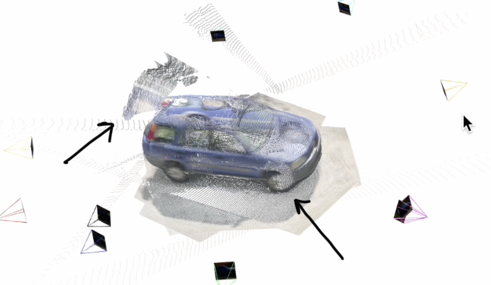
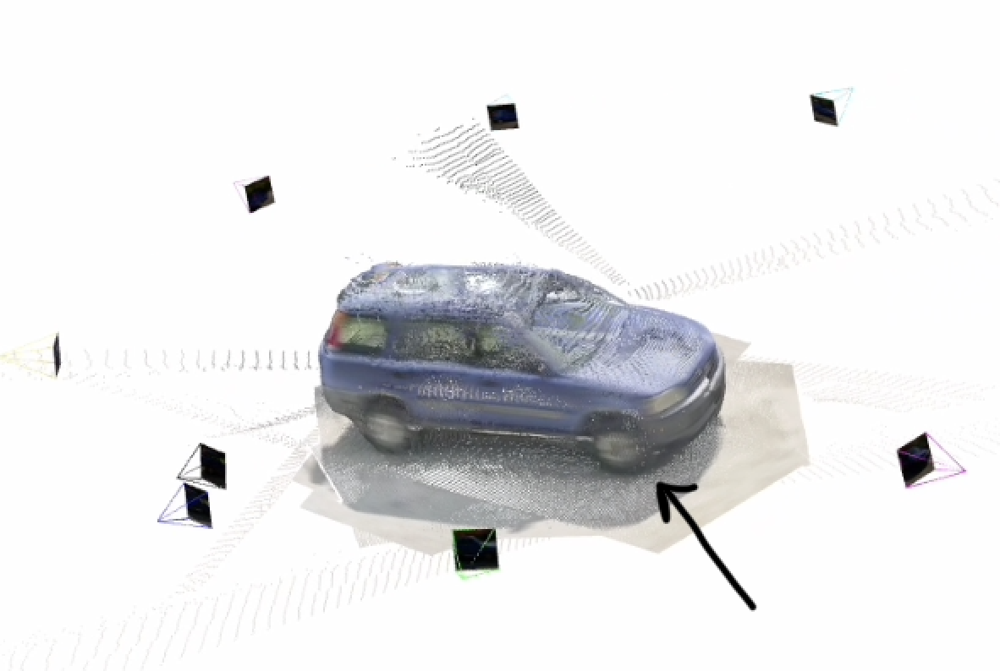
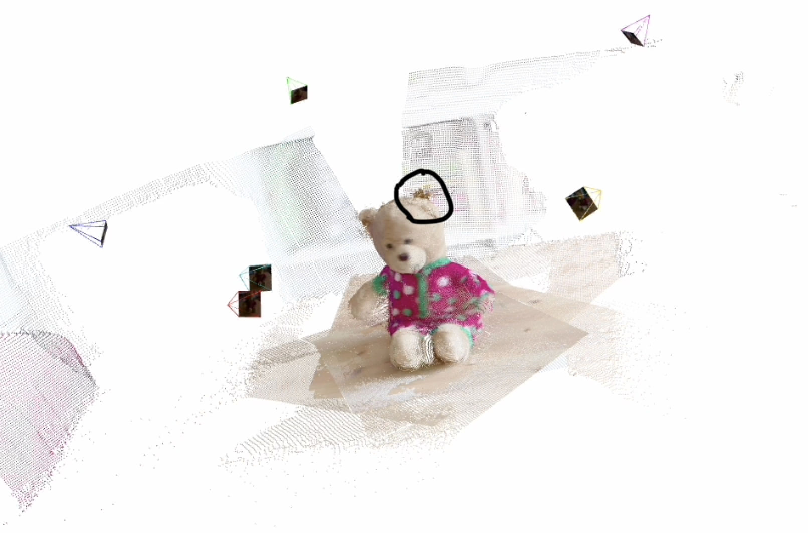
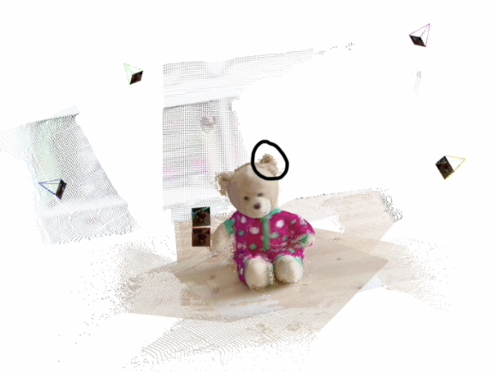

# Robust Multi-View 3D Reconstruction with DUSt3R under Image Degradations

Master thesis research code: improving **DUSt3R** point-cloud quality when input views are **motion-blurred, defocus-blurred, or Gaussian-blurred**, using lightweight front-ends, knowledge distillation, and joint finetuning—without redesigning the full DUSt3R backbone.

**Author:** Hayk Minasyan (`haykminasyan-devAI`)  
**Base model:** [DUSt3R](https://github.com/naver/dust3r) (ViT-L, 512 DPT and/or 224 linear checkpoints)  
**Dataset:** CO3D multi-category object-centric sequences

---

## Qualitative results

Side-by-side reconstructions on held-out CO3D frames. **Baseline** = pretrained DUSt3R on the degraded input; **Ours** = the proposed pipeline (deblurring / restoration front-end + DUSt3R, depending on the experiment).

### Car sequence

| Baseline DUSt3R | Ours |
|-----------------|------|
|  |  |

### Teddybear sequence

| Baseline DUSt3R | Ours |
|-----------------|------|
|  |  |

---

## Problem

DUSt3R estimates dense geometry from unordered image collections. In practice, views are often:

- **Motion-blurred** (camera or object movement)
- **Defocus-blurred** (shallow depth of field)
- **Gaussian-blurred** (optics, defocus-like softness, haze)

These degradations hurt pairwise matching and global alignment, which increases **Chamfer distance** to CO3D ground-truth point clouds. This repository studies **front-end restoration and finetuning** so DUSt3R sees cleaner inputs—or learns features that are robust to corruption—while keeping the core architecture practical to train on a single GPU or small multi-GPU node.

---

## Main approaches in this repository

| Line | Idea | Folder |
|------|------|--------|
| **DeblurDiNAT + DUSt3R** | Learned deblurring front-end (NATTEN) before frozen or partially trained DUSt3R; finetuned on synthetic Gaussian blur σ ∈ {5,10,20,30,(50)} | `finetune_blur/`, `interactive_demo/` |
| **Motion & defocus finetuning** | Same joint model; on-the-fly synthetic motion (25×25 horizontal PSF) and defocus (disk *r*=7, 15×15) | `finetuning Motion&Defocus/` |
| **KD Restormer student** | Lightweight U-Net student distilled from frozen Restormer teachers (motion + defocus branches); stronger training blur (35×35 motion, *r*=9 defocus) | `restoration_kd_ysu/` |
| **Other front-ends** | Uformer, IFAN, motion LoRA, defocus IFAN experiments | `finetune_motion_blur/`, `finetune_defocus/`, `finetune_noise/`, … |

**Evaluation:** multi-view inference + global alignment + **Chamfer** vs. CO3D GT (`eval-*`, `evaluation-*`, `EVAL-*`).

**Interactive demo:** Gradio UI to upload frames and switch pipelines (baseline, DeblurDiNAT finetuned, KD Restormer)—see `interactive_demo/README.md`.

---

## Synthetic degradations (used in training / eval)

| Type | Kernel / parameters | Typical use |
|------|---------------------|-------------|
| **Motion blur** | Normalized horizontal line on 25×25 support (eval / viz); 35×35 in severe KD training | `restoration_kd_ysu`, eval scripts |
| **Defocus blur** | Normalized disk, *r*=7 → 15×15; *r*=9 → 19×19 (KD training) | Motion–defocus finetuning, KD |
| **Gaussian blur** | Isotropic σ ∈ {5, 10, 20, 30, 50} pixels | DeblurDiNAT joint finetuning |

Degradations are applied by **convolution** on RGB frames (OpenCV / SciPy), with reflect padding at borders.

---

## Repository layout (high level)

```
project_Hayk_Minasyan/
├── dust3r/                    # DUSt3R code (local modifications)
├── finetune_blur/             # DeblurDiNAT + DUSt3R (Gaussian blur)
├── finetuning Motion&Defocus/ # DeblurDiNAT + DUSt3R (motion / defocus)
├── restoration_kd_ysu/        # KD Restormer student front-end
├── interactive_demo/          # Gradio demo
├── eval-*/ evaluation-*/    # Chamfer evaluation
├── scripts/                   # Data prep, Slurm, degradation utilities
├── carDUS3tR.png … teddyOURS.png   # Qualitative figures (this README)
└── GITHUB_PUSH.md             # What to commit vs. ignore (data, weights)
```

**Not in git:** CO3D images, `.pth` checkpoints, `outputs/`, `finetune_blur_runs/`, vendor clones (`DeblurDiNAT/`, `IFAN/`, `Uformer/`)—see `GITHUB_PUSH.md`.

---

## Setup (short)

1. **Environment:** Python 3.10+, CUDA; `conda activate co3d_env` (or equivalent).
2. **Dependencies:** `pip install -r dust3r/requirements.txt` (+ project-specific extras per subfolder README).
3. **Clone vendors** (not vendored in git):
   ```bash
   git clone <DeblurDiNAT-repo-url> DeblurDiNAT
   ```
4. **Download DUSt3R weights** (e.g. `DUSt3R_ViTLarge_BaseDecoder_512_dpt.pth`) into `checkpoints/` or `interactive_demo/demo_ckpts/`.
5. **CO3D data** on cluster path (e.g. `data/co3d/…` or rsync from YSU `co3d_processed_10cat`).

Subfolders contain Slurm scripts (`submit_*.slurm.sh`) for YSU / ASDS partitions.

---

## Demo (one GPU)

```bash
salloc --partition=a100 --gres=gpu:1 --cpus-per-task=8 --mem=64G --time=4:00:00
cd ~/project_Hayk_Minasyan
bash interactive_demo/run_demo_on_node.sh
# SSH tunnel: ssh -L 7860:<compute-node>:7860 user@login
```

Upload frames from `outputs/viz_selections/` (clean, `blur_s10`, `motion_k25`, etc.) and select a **Pipeline** in the UI.

---

## Citation

If you use DUSt3R, please cite the original paper and checkpoint license terms from [Naver Labs DUSt3R](https://github.com/naver/dust3r). DeblurDiNAT, Restormer, and other third-party modules have their own licenses in the respective repositories.

---

## License & data

- **Code in this repo:** research / thesis use; follow licenses of bundled dependencies.
- **CO3D:** subject to the CO3D dataset license; do not redistribute downloaded frames via this repository.

For push instructions and large-file exclusions, see **[GITHUB_PUSH.md](GITHUB_PUSH.md)**.
